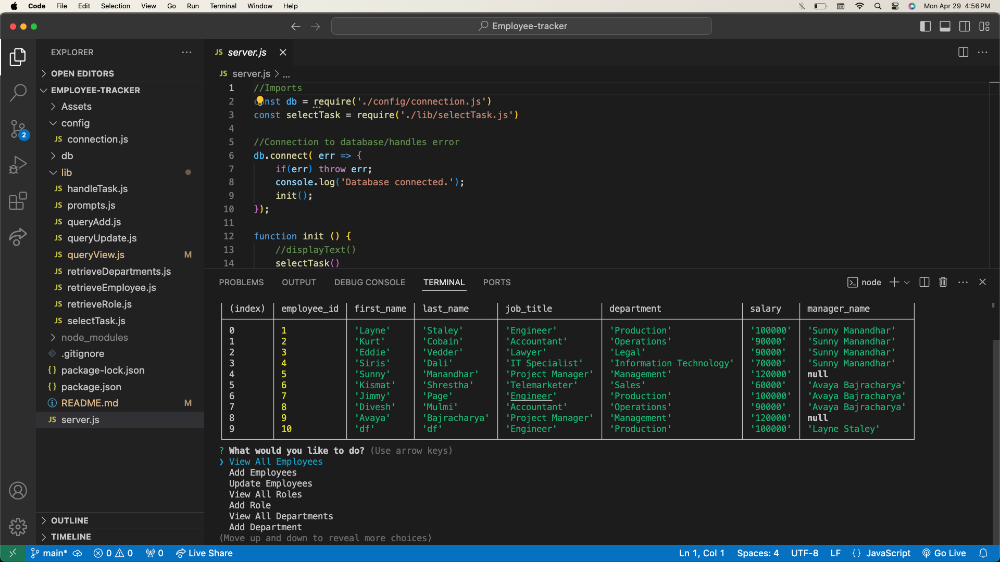
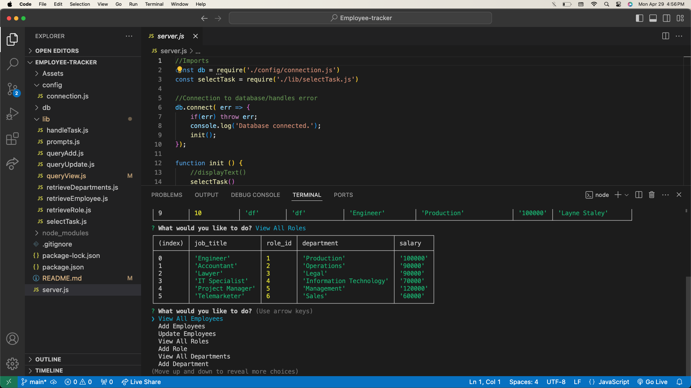
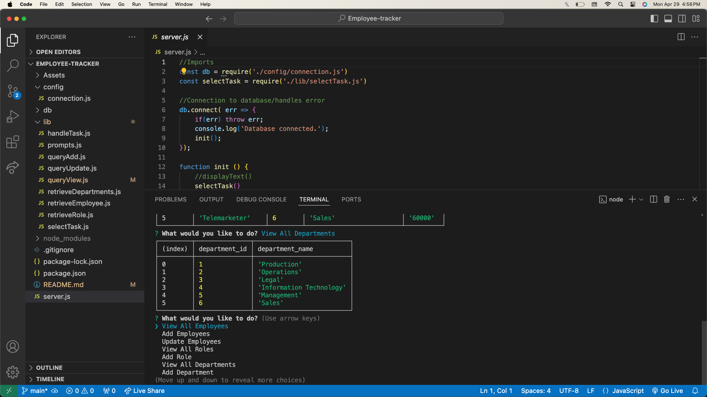

# Employee Tracker

 
 

# Description
Employee Tracker is a command-line content management system (CMS) application that allows users to add, view, update data relating to employees, roles and departments to manage a company's employee database, using Node.js, Inquirer, and MySQL.

Here is the demonstration of the application.\
[Video demo of the application.](https://drive.google.com/file/d/1PVmYQxUEuJ4b2uU4FkT5ImhlsNSSeDro/view?usp=sharing)

  ## Table of Contents

* [Installation](#installation)
* [Usage](#usage)
* [Screenshots](#screenshots)
* [License](#license)
* [Contributing](#contributing)
* [Contact](#contact)

## Installation
1. Check if you have Node.js installed by typing "node -v" in your command line. If node is not installed, visit the Node.js website to install.
2. Next, clone this project repository to your computer.
3. Use the command "npm install" to install dependecies.
4. Type "mysql -u root -p" in the terminal and enter your personal MySQL password
5. Next, type "source schema.sql" and "source seeds.sql" (These commands will create the employee_db database and seed the database with mock data.).

## Usage

1. Open terminal in "server.js" and run the command "npm start".
2. Select a desired task and follow the Inquirer prompts.
3. Choose another task or exit the application.
4. To exit application, choose "EXIT" from task prompt list.
5. Reference the video demonstration above as needed.

## Screenshots
Here are some of the screenshots of the application.

## License

## Contributing

There are no guidelines for contributing at this time. Contact me with any ideas or requests if anybody want to contribute.

## Contact
* Email: jujunakarmi@gmail.com
* LinkedIn:[https://www.linkedin.com/in/juju-nakarmi-1a79a7181/](https://www.linkedin.com/in/juju-nakarmi-1a79a7181/)